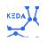
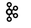

# Rajesh Joshi | Senior Software Engineer Specialized in Scalable Backend Solutions

Welcome to my portfolio projects repository! This space showcases various projects I have built, using a diverse set of technologies. These projects demonstrate my expertise in software development, system design, and leveraging cutting-edge tools, frameworks, and concepts.

---

## Table of contents

- [Projects](#projects)
  - [Webhook Plan](#webhook-plan)
  - [RBAC Organization](#rbac-organization)
- [Categories and Technologies](#categories-and-technologies)
  - [Concepts (8)](#concepts)
  - [Programming Languages (3)](#programming-languages)
  - [Frameworks/Libraries (5)](#frameworkslibraries)
  - [Tools (18)](#tools)
  - [Message Brokers (2)](#message-brokers)
  - [Databases (7)](#databases)
  - [Cloud Providers (3)](#cloud-providers)
  - [Operating System (3)](#operating-system)
- [Repository Structure](#repository-structure)
- [Let's Connect](#lets-connect)

---

## Projects

Below is a glimpse of some of the featured projects:

### **Webhook Plan**

- **Technologies**: Django, DRF, PostgreSQL, Celery, Celery Beat, Docker
- **Description**: A powerful tool for effortless job scheduling and webhook management.
- **Link**: [github.com/webhookplan/webhookplan](https://github.com/webhookplan/webhookplan)

### **RBAC Organization**

- **Technologies**: Django, DRF, PostgreSQL, Docker, ReactJS, MUI
- **Description**: Role Based Access Contol(RBAC) and User Management template using Django, DRF and ReactJS
- **Link:** N/A

more to be added soon...

---

## Categories and Technologies

### Concepts

| Name                     | Projects                                        | Experience Level |
| ------------------------ | ----------------------------------------------- | ---------------- |
| **Microservices**        | [microservices](./microservices/)               | ⭐️⭐️⭐️⭐️⭐️  |
| **Data Pipelines**       | [data-pipelines](./data-pipelines/)             | ⭐️⭐️⭐️⭐️⭐️  |
| **Event-Driven Design**  | [event-driven-design](./event-driven-design/)   | ⭐️⭐️⭐️⭐️⭐️  |
| **Domain-Driven Design** | [domain-driven-design](./domain-driven-design/) | ⭐️⭐️⭐️⭐️⭐️  |
| **System Design**        | [system-design](./system-design/)               | ⭐️⭐️⭐️⭐️⭐️  |
| **Algorithms**           | [algorithms](./algorithms/)                     | ⭐️⭐️⭐️⭐️⭐️  |
| **WebSockets**           | [websockets](./websockets/)                     | ⭐️⭐️⭐️        |
| **Migration Strategies** | [migration-strategies](./migration-strategies/) | ⭐️⭐️⭐️        |

### Programming Languages

| Logo                          | Name           | Projects                    | Experience Level |
| ----------------------------- | -------------- | --------------------------- | ---------------- |
|  | **Python**     | [python](./python/)         | ⭐️⭐️⭐️⭐️⭐️  |
|  | **JavaScript** | [javascript](./javascript/) | ⭐️⭐️⭐️⭐️⭐️  |
|          | **Go**         | [go](./go/)                 | ⭐️⭐️⭐️⭐️     |

### Frameworks/Libraries

| Logo                            | Name                            | Projects              | Experience Level |
| ------------------------------- | ------------------------------- | --------------------- | ---------------- |
|    | **Django**                      | [django](./django/)   | ⭐️⭐️⭐️⭐️⭐️  |
|          | **DRF (Django Rest Framework)** | [drf](./drf/)         | ⭐️⭐️⭐️⭐️⭐️  |
|  | **FastAPI**                     | [fastapi](./fastapi/) | ⭐️⭐️⭐️⭐️⭐️  |
|    | **WebRTC**                      | [webrtc](./webrtc/)   | ⭐️⭐️⭐️⭐️⭐️  |
|   | **Node.js**                     | [nodejs](./nodejs/)   | ⭐️⭐️⭐️⭐️     |

### Tools

| Logo                                      | Name               | Projects                            | Experience Level |
| ----------------------------------------- | ------------------ | ----------------------------------- | ---------------- |
|             | **Kubernetes**     | [kubernetes](./kubernetes/)         | ⭐️⭐️⭐️⭐️⭐️  |
|              | **Docker**         | [docker](./docker/)                 | ⭐️⭐️⭐️⭐️⭐️  |
|                  | **Keda**           | [keda](./keda/)                     | ⭐️⭐️⭐️⭐️⭐️  |
|                | **Nginx**          | [nginx](./nginx/)                   | ⭐️⭐️⭐️⭐️⭐️  |
|                    | **SSH**            | [ssh](./ssh/)                       | ⭐️⭐️⭐️⭐️⭐️  |
|              | **Celery**         | [celery](./celery/)                 | ⭐️⭐️⭐️⭐️     |
|      | **Cloudflare**     | [cloudflare](./cloudflare/)         | ⭐️⭐️⭐️        |
|                  | **Dapr**           | [dapr](./dapr/)                     | ⭐️⭐️           |
|  | **GitHub Actions** | [github-actions](./github-actions/) | ⭐️⭐️           |
|          | **CircleCI**       | [circleci](./circleci/)             | ⭐️⭐️           |
|            | **Ansible**        | [ansible](./ansible/)               | ⭐️              |
|                  | **Chef**           | [chef](./chef/)                     | ⭐️              |
|            | **Datadog**        | [datadog](./datadog/)               | ⭐️              |
|            | **Grafana**        | [grafana](./grafana/)               | ⭐️              |
|          | **Loki**           | [loki](./loki/)                     | ⭐️              |
|      | **Prometheus**     | [prometheus](./prometheus/)         | ⭐️              |
|        | **Terraform**      | [terraform](./terraform/)           | ⭐️              |

### Message Brokers

| Logo                              | Name         | Projects                | Experience Level |
| --------------------------------- | ------------ | ----------------------- | ---------------- |
|  | **RabbitMQ** | [rabbitmq](./rabbitmq/) | ⭐️⭐️⭐️⭐️⭐️  |
|        | **Kafka**    | [kafka](./kafka/)       | ⭐️⭐️⭐️⭐️     |

### Databases

| Logo                                  | Name           | Projects                    | Experience Level |
| ------------------------------------- | -------------- | --------------------------- | ---------------- |
|  | **PostgreSQL** | [postgresql](./postgresql/) | ⭐️⭐️⭐️⭐️⭐️  |
|            | **MySQL**      | [mysql](./mysql/)           | ⭐️⭐️⭐️⭐️⭐️  |
|            | **Redis**      | [redis](./redis/)           | ⭐️⭐️⭐️⭐️⭐️  |
|    | **Snowflake**  | [snowflake](./snowflake/)   | ⭐️⭐️⭐️        |
|    | **Cassandra**  | [cassandra](./cassandra/)   | ⭐️⭐️           |
|        | **MongoDB**    | [mongodb](./mongodb/)       | ⭐️⭐️           |
|     | **Influx DB**  | [influxdb](./influxdb/)     | ⭐️              |
|            | **Neo4j**      | [neo4j](./neo4j/)           | ⭐️              |

### Cloud Providers

| Logo                              | Name         | Experience Level |
| --------------------------------- | ------------ | ---------------- |
|            | **GCP**      | ⭐️⭐️⭐️⭐️⭐️  |
|            | **AWS**      | ⭐️⭐️⭐️⭐️⭐️  |
|  | **Firebase** | ⭐️⭐️⭐️⭐️⭐️  |

### Operating System

| Logo                            | Name        | Experience Level |
| ------------------------------- | ----------- | ---------------- |
|      | **Linux**   | ⭐️⭐️⭐️⭐️⭐️  |
|     | **MacOS**   | ⭐️⭐️⭐️⭐️⭐️  |
|  | **Windows** | ⭐️⭐️⭐️⭐️⭐️  |

---

## Repository Structure

Each folder in this repository corresponds to a specific technology or project category. Inside each folder, you'll find:

- **Code**: The implementation of the project.
- **Documentation**: A detailed explanation of the project, including design decisions, challenges, and learnings.
- **Demo**: Screenshots or video links showcasing the project's functionality (if applicable).

---

## Let's Connect

If you have any questions or want to collaborate on a project, feel free to reach out:

- **Email**: [joshirajesh448@gmail.com](mailto:joshirajesh448@gmail.com)
- **X**: [/rajesh_j3](https://x.com/rajesh_j3)
- **LinkedIn**: [/in/rajeshj3](https://www.linkedin.com/in/rajeshj3/)
- **Dev.to**: [/rajeshj3](https://dev.to/rajeshj3)
- **YouTube**: [@stacklesstech](https://www.youtube.com/@stacklesstech)
- **Location**: India

---

Thank you for visiting my portfolio repository! 🚀
